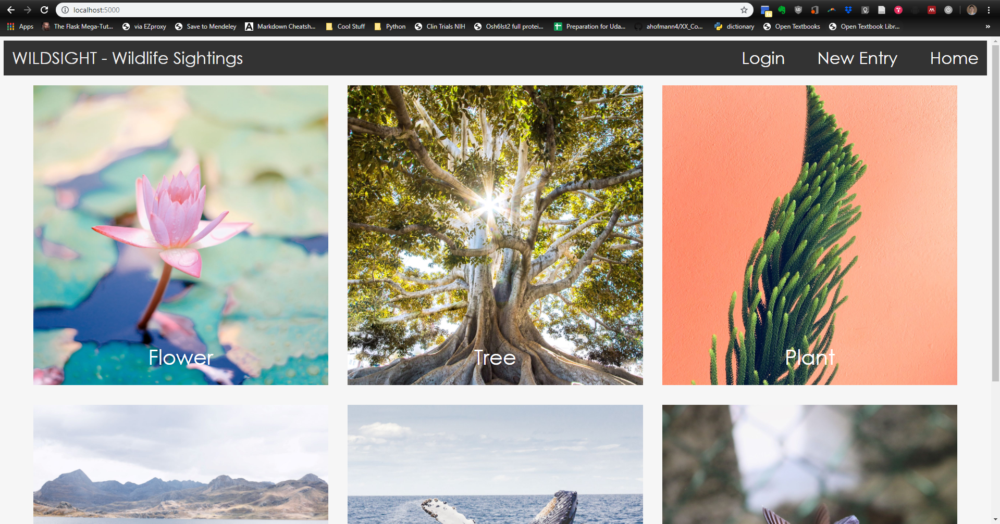
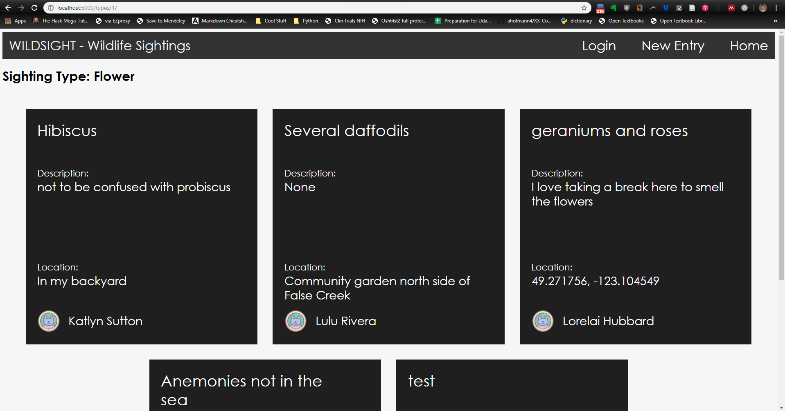
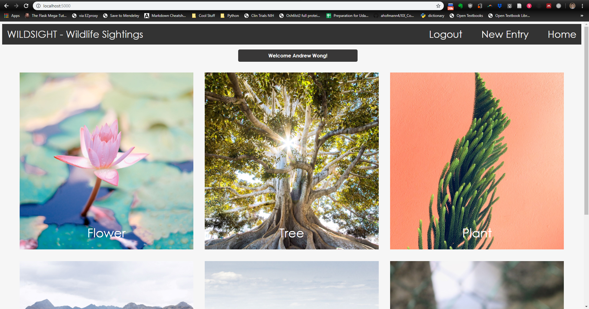
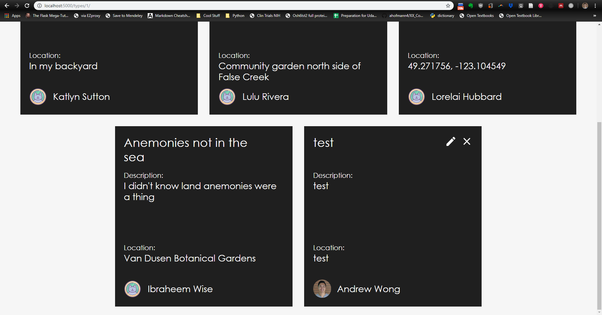
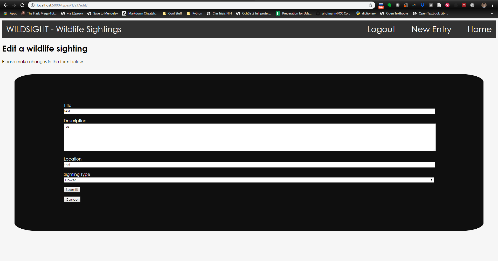

# Wildsight
Wildsight is a website for users to submit information about interesting sightings of wildlife that they encounter. Users can log in with Google signin, and can submit a title, description, and a location of a sighting, within six categories of sightings.

This is a project for Udacity's Full Stack Nanodegree.

## Getting started
### Prerequisites

This project was built using a Vagrant virtual machine configured by Udacity:
* Vagrant managed virtual machine (VM)
    - Download and install [VirtualBox](https://www.virtualbox.org/wiki/Downloads) VM
    - Download and install [Vagrant](https://www.vagrantup.com/downloads.html) to configure the VM
    - Download [VM configuration files](https://s3.amazonaws.com/video.udacity-data.com/topher/2018/April/5acfbfa3_fsnd-virtual-machine/fsnd-virtual-machine.zip)
    and unzip the directory.

It also uses ```python 3.5.2``` installed on the VM. You can obtain this at:
* Python 3
    - [Official distribution](https://www.python.org/downloads/)
    - [Anaconda distribution](https://www.anaconda.com/distribution/) if you're into data science.

The webserver was built using the lightweight web framework ```flask```:
* Flask
    - [Documentation](https://flask.palletsprojects.com/en/1.1.x/)

Forms for editing sightings are built with ```wtforms``` and ```flask_wtf```:  
* [WTForms](https://wtforms.readthedocs.io/en/stable/)
    - [Flask wtform design pattern](https://flask.palletsprojects.com/en/1.0.x/patterns/wtforms/)
* [Flask-WTF](https://flask-wtf.readthedocs.io/en/stable/)  


A full list of python packages in the VM environment is given in ```requirements.txt``` found in the main app folder. You can install using: 
``` 
pip3 install -r requirements.txt
```

### Setting up the webserver
Wildsight uses ```sqlite3``` as its database. This database needs to be initialized:  
```
python3 database_setup.py   # Sets up the db and defines its schema.
python3 populate_db.py      # Populate the database with demo data.
```
Placeholder user data is found in comma separated value files found in the ```demo_data``` folder.  

The wildsight ```sqlite3``` database exists as ```wildsight.db``` in the app folder. If things need to be reset entirely, ```reset_server.sh``` is a convenience script that removes the ```.db``` file and runs the two setup python scripts above.

To start the webserver, run:
```
python3 wildsight.py
```
This will start a webserver locally at ```localhost:5000```.

## Design Walkthrough

The homepage offers six sighting types that can be clicked, with a short darkening animation upon hover.



Clicking into a sighting type opens a page listing sightings of that type, displayed using CSS flexboxes.



Logging in via the navigation bar offers Google Signin, producing a nice little flash message upon successful login.



Logged in users see extra edit and delete icons next to sightings they have created.



Sighting editing is accomplished by a form built with ```wtforms``` and ```flask_wtf```.



I decided not to offer users the option to submit arbitrary sighting types, as I think the number of sensible sighting types is probably limited, and I wanted the sighting types to be represented by nice images. However, as sighting types are also in a db table, it would not be too difficult to add that functionality.

### JSON API
Several API endpoints providing sighting data in JSON format:
```
# All sightings in the database
/api/sightings/

# A specific sighting given an id integer
/api/sightings/<sighting_id>/

# A list of the different sighting types and their ids
/api/types/

# All sightings of a particular type given an id
/api/types/<type_id>
```

### Future improvements
Several features might be good improvements in the future:

* Adding the capability to upload pictures.  
* Adding the option of using Google Maps API for location information.
* Adding the ability to add user-defined sighting types
* Cross-user feedback/commenting on a sighting

## Authors
* Andrew K.O. Wong

## Acknowledgements

The Udacity FSND courseware provided strong starting points for this codebase.  
Authentication code is derived from code on the Google OAuth2 Documentation [here](https://developers.google.com/identity/sign-in/web/) and [here](https://developers.google.com/identity/protocols/OAuth2).

### Home page image credits
Tree - Photo by Jeremy Bishop on Unsplash  
Plant - Photo by Caleb George on Unsplash  
Flower - Photo by Saffu on Unsplash  
Land Animal - Photo by Dan Romero on Unsplash  
Sea Animal - Photo by Thomas Kelley on Unsplash   
Air Animal - Photo by Brian Yurasits on Unsplash  
